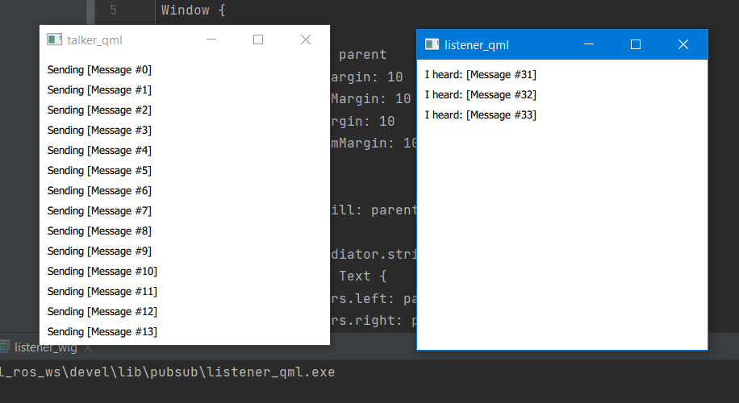

# ROS_QML_Example
A test project to show how to use QT5 QML and Widgets in a ROS node

This project was created so that I could work out some workflow kinks when using ROS and QT5 together to create a QML or QtWidgets gui node. 
The repo should be pulled into the /src directory of a catkin workspace and built with catkin_make. 
All the examples are in the ros package 'pubsub'. 

There are four examples in the repo, each consisting of a 'talker' and 'listener' program:
* listener/talker
* listener_qt/talker_qt
* listener_qml/talker_qml
* listener_wig/talker_wig

The 'talker' program publishes a message every 5 seconds and the 'listener' program listens to them.
All the talkers should be compatible with all the listeners

## Example run

In terminal A: `roscore`

In terminal B: `rosrun pubsub talker_qml`

In terminal C: `rosrun pubsub listener_qml`

## Demo

